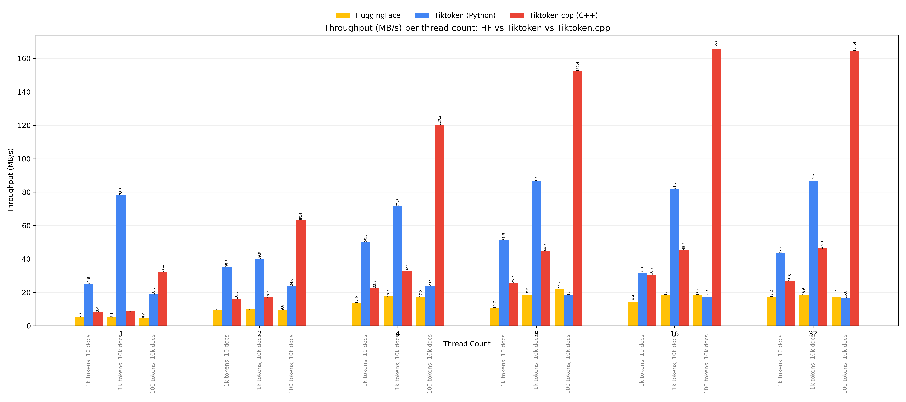

# tiktoken.cpp

High-performance, header-only tiktoken implementation in C++ with a small wrapper API and examples. It mirrors the behavior of OpenAI's tiktoken for common operations and supports custom encodings via local .tiktoken BPE files.

Highlights
- Core BPE engine in `src/_tiktoken.hpp` and friendly API in `src/tiktoken.hpp`
- PCRE2 regex splitting with JIT acceleration when available
- Zero-allocation hot paths for faster encoding/decoding
- Examples and a simple benchmark CLI

## Requirements

- C++17 toolchain (AppleClang, clang, or GCC)
- Conan 2.x for dependencies (PCRE2 and utfcpp)
- CMake ≥ 3.20

macOS quick tips
- Install Conan: `pipx install conan` or `pip install --user conan`
- Ensure developer tools: `xcode-select --install`

## Build (recommended: Conan presets)

This project uses Conan to fetch PCRE2 and utfcpp and generates a CMake preset that wires everything for you.

1) Detect a profile (first time only):
	 - `conan profile detect -f`

2) Install deps and generate presets into the project root (toolchain/presets go under `build/Release/`):
	 - `conan install . --output-folder=. --build=missing -s build_type=Release`

3) Configure and build (flat preset writes build files to `build/`):
	 - `cmake --preset conan-release-flat`
	 - `cmake --build --preset conan-release-flat -j`

Alternative: plain CMake (if you already have PCRE2 + utfcpp)
- Set `CMAKE_PREFIX_PATH` to point to your PCRE2/utfcpp install roots so `find_package(PCRE2)` and `find_package(utf8cpp)` succeed.

## What gets built

- Library interface target: `tiktoken` (header-only)
- Example app: `cpp_basic`
- Benchmark app: `tiktoken_benchmark`

Defaults can be toggled in `CMakeLists.txt`:
- `TIKTOKEN_BUILD_EXAMPLES` (ON)
- `TIKTOKEN_BUILD_BENCHMARKS` (ON)

## Usage (library)

The public API is in `src/tiktoken.hpp`. Minimal example:

```cpp
#include "tiktoken.hpp"
using namespace tiktoken;

int main() {
	// Build a tiny demo encoding (bytes 0..255 map to ids 0..255; a single special token)
	EncodingDefinition def;
	def.name = "minimal_demo";
	def.pat_str = R"('(?:[sdmt]|ll|ve|re)| ?\p{L}++| ?\p{N}++| ?[^\s\p{L}\p{N}]++|\s++$|\s+(?!\S)|\s)";
	for (int b = 0; b < 256; ++b) def.mergeable_ranks.push_back({U8Vec{static_cast<U8>(b)}, static_cast<Rank>(b)});
	def.special_tokens = {{"<|endoftext|>", 256}};
	def.explicit_n_vocab = 257;

	register_encoding(def);
	auto enc = get_encoding(def.name);

	auto tokens = enc->encode("hello world");
	auto bytes = enc->decode_bytes(tokens);
	auto text = std::string(reinterpret_cast<const char*>(bytes.data()), bytes.size());
}
```

Or load a real BPE file (`.tiktoken`) and run cl100k-style encoding:

```cpp
auto ranks = tiktoken::load_tiktoken_bpe_from_file("cl100k_base.tiktoken");
tiktoken::EncodingDefinition def;
def.name = "cl100k_base";
def.pat_str = R"('(?i:[sdmt]|ll|ve|re)|[^\r\n\p{L}\p{N}]?+\p{L}++|\p{N}{1,3}+| ?[^\s\p{L}\p{N}]++[\r\n]*+|\s++$|\s*[\r\n]|\s+(?!\S)|\s)";
def.mergeable_ranks = std::move(ranks);
def.special_tokens = {{"<|endoftext|>", 100257}, {"<|fim_prefix|>", 100258}, {"<|fim_middle|>", 100259}, {"<|fim_suffix|>", 100260}, {"<|endofprompt|>", 100276}};
tiktoken::register_encoding(def);
auto enc = tiktoken::get_encoding(def.name);
auto toks = enc->encode("hello world");
```

## Example app

`cpp_basic` demonstrates loading a `.tiktoken` file or using a minimal demo:
- With BPE: `./build/cpp_basic build/cl100k_base.tiktoken "hello world"`
- Demo fallback (no args): `./build/cpp_basic`

## Running Benchmarks

Simple CLI to loop on `encode(text)` and report throughput:

- Demo mode (no BPE):
	- `./build/tiktoken_benchmark --iters 200 --progress`

- With a BPE and input file:
	- `./build/tiktoken_benchmark --bpe build/cl100k_base.tiktoken --file build/bench.txt --iters 1000 --progress`

Flags
- `--bpe <path>`: `.tiktoken` file (base64 bytes + rank per line)
- `--file <path>`: text to encode (raw text)
- `--iters N` (default 1000)
- `--progress`: prints progress dots to stderr

Notes on performance
- PCRE2 JIT is enabled automatically when available.
- Hot-path lookups avoid per-match allocations.
- Throughput depends strongly on the regex pattern and text; try Release builds.

## Benchmark Results

### Throughput Comparison (Tokens/sec)

The following chart compares the encoding throughput of `tiktoken.cpp` (C++), `tiktoken` (Python), and Hugging Face `tokenizers` (Rust/Python bindings) across different text sizes.


**Legend:**
*   **C++**: `tiktoken.cpp` (Optimized C++)
*   **Py**: `tiktoken` (Original Python/Rust)
*   **HF**: Hugging Face `tokenizers`

### Detailed Data

| Text Size | tiktoken.cpp (C++) | tiktoken (Python) | HF Tokenizers | Speedup (C++ vs Py) |
| :--- | :--- | :--- | :--- | :--- |
| **1KB** | ~4.8M | ~2.5M | ~0.9M | **1.9x** |
| **4KB** | ~1.7M | ~3.8M | ~0.9M | 0.45x |
| **16KB** | ~3.2M | ~4.1M | ~0.9M | 0.8x |
| **64KB** | ~4.3M | ~3.7M | ~0.8M | **1.2x** |
| **256KB** | ~8.0M | ~4.3M | ~0.7M | **1.9x** |
| **1MB** | **~9.0M** | ~4.2M | ~0.7M | **2.1x** |

### Multithreaded Throughput (MB/s)

The following chart shows the throughput in MB/s for different batch scenarios across thread counts, comparing `tiktoken.cpp` (C++), `tiktoken` (Python), and Hugging Face `tokenizers`.



### Batch Processing (100KB Total)

| Threads | tiktoken.cpp (Tokens/sec) |
| :--- | :--- |
| 1 | ~4.3M |
| 4 | ~12.2M |
| 8 | ~13.2M |
| 16 | ~13.0M |

`tiktoken.cpp` achieves **~13M tokens/sec** in batch mode, effectively saturating the CPU.

## Troubleshooting

- CMake can’t find PCRE2/utf8cpp
	- Use Conan flow shown above, or set `CMAKE_PREFIX_PATH` to where these packages are installed.
	- On macOS with Homebrew, you might set: `-DCMAKE_PREFIX_PATH="/opt/homebrew/opt/pcre2;/opt/homebrew/opt/utf8cpp"`

- Preset not found / toolchain warnings
	- Ensure you ran: `conan install . --output-folder=build --build=missing -s build_type=Release`
	- Then run either:
		- `cmake --preset conan-release && cmake --build --preset conan-release -j` (nested build dirs)
		- or `cmake --preset conan-release-flat && cmake --build --preset conan-release-flat -j` (flat build dir)

- Xcode/Clang issues
	- Make sure command-line tools are installed: `xcode-select --install`

- Slow debug builds
	- Use `-DCMAKE_BUILD_TYPE=Release` or the `conan-release` preset. Regex JIT and hot paths shine in Release.

## License

MIT. See `LICENSE`.

## Acknowledgments

Inspired by OpenAI’s tiktoken and Rust implementations of BPE tokenizers.
